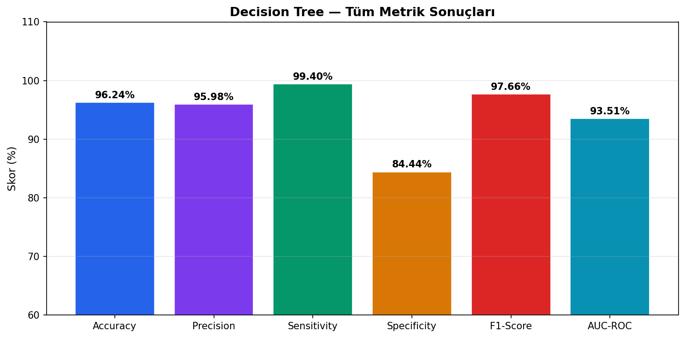
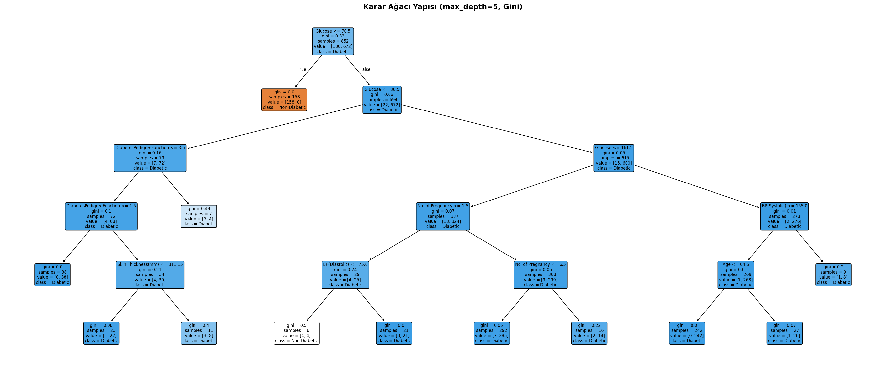
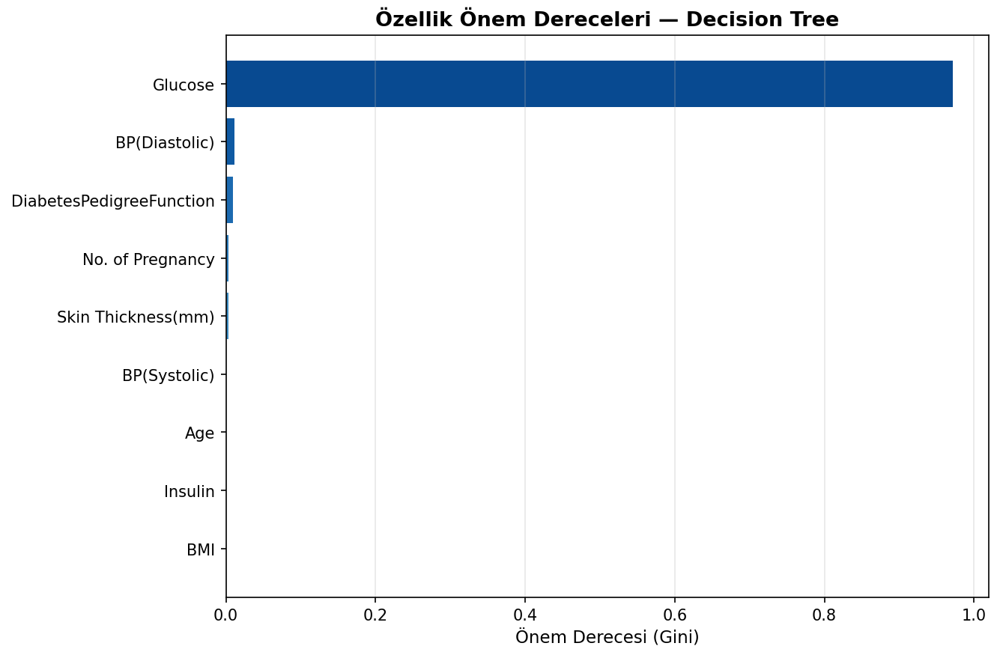
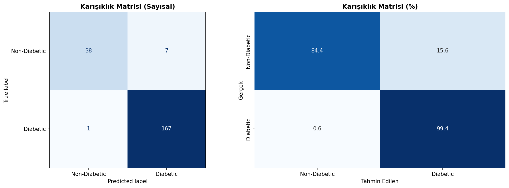
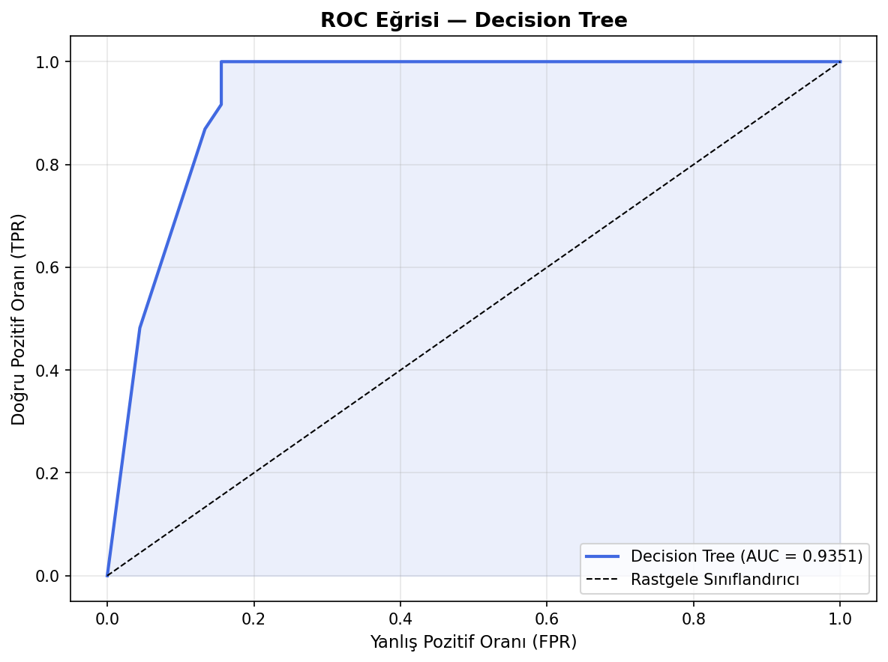
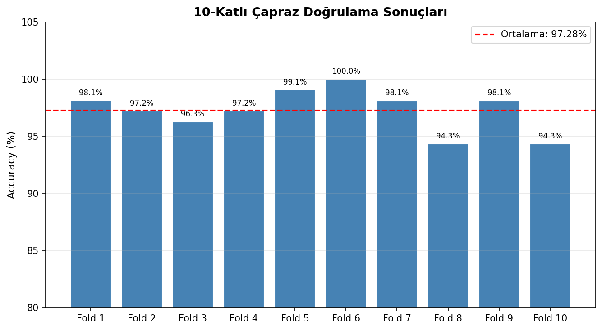

# Diyabet Tahmini - Karar Ağacı (Decision Tree)

Bu proje, diyabet veri seti üzerinden "Tip-2 Diyabet" tahminlemesi yapmak amacıyla **Karar Ağacı (Decision Tree Classifier)** kullanılarak geliştirilmiştir.

## Kullanılan Model
- **Algoritma**: Decision Tree Classifier (Gini Impurity, Max Depth: 5)
- **Amaç**: İkili Sınıflandırma (0: Non-Diabetic, 1: Diabetic)

## Sonuçların Değerlendirmesi

Model oldukça yüksek bir başarı ve kararlılık göstermiştir. 
- **Doğruluk (Accuracy)**: %96.24
- **Hassasiyet (Precision)**: %95.98
- **Duyarlılık (Recall)**: %99.40
- **10-Katlı Çapraz Doğrulama (CV) Ortalaması**: %97.28

Özellikle **Duyarlılık (Recall)** oranının %99.40 olması modelin hastaları kaçırmadan tespit etmekte çok başarılı olduğunu göstermektedir. Bu, tıbbi teşhis projelerinde en çok istenen durumdur.

## Görsel Çıktılar ve Analizler

Aşağıda modelin değerlendirilmesine yönelik üretilen görsel çıktılar yer almaktadır.

### 1. Karar Ağacı Yapısı
Modelin hastaları sınıflandırmak için hangi kuralları çıkardığı aşağıda görselleştirilmiştir:

### 2. Özellik Önem Dereceleri (Feature Importance)
Modelin diyabet teşhisi yaparken hangi faktörlerden (Glikoz, Yaş, Tansiyon vb.) daha çok etkilendiği:

### 3. Karışıklık Matrisi (Confusion Matrix)
Gerçek değerler ile tahmin edilen değerlerin çapraz tablosu:

### 4. ROC Eğrisi
Modelin pozitif sınıfı negatiften ayırma kapasitesi. (Eğri altında kalan alan, AUC = 0.9351):

### 5. 10-Katlı Çapraz Doğrulama Sonuçları
Modelin sadece tek bir eğitim/test ayrımında değil, veri setinin farklı bölümlerinde de dengeli (%97.28 ortalama) bir sonuç verdiği görülmektedir:

